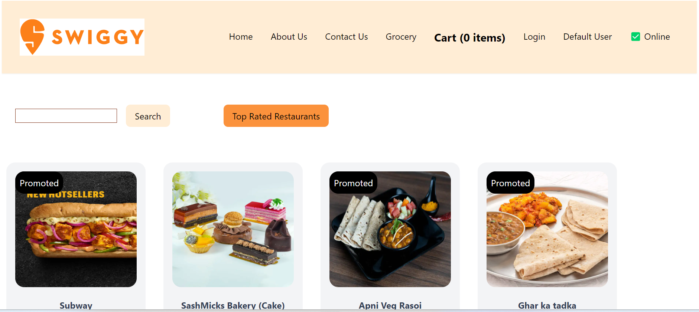
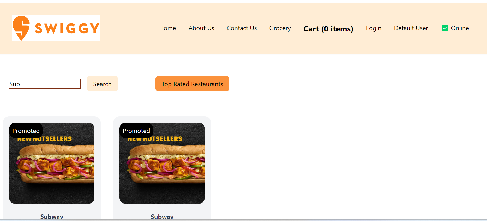
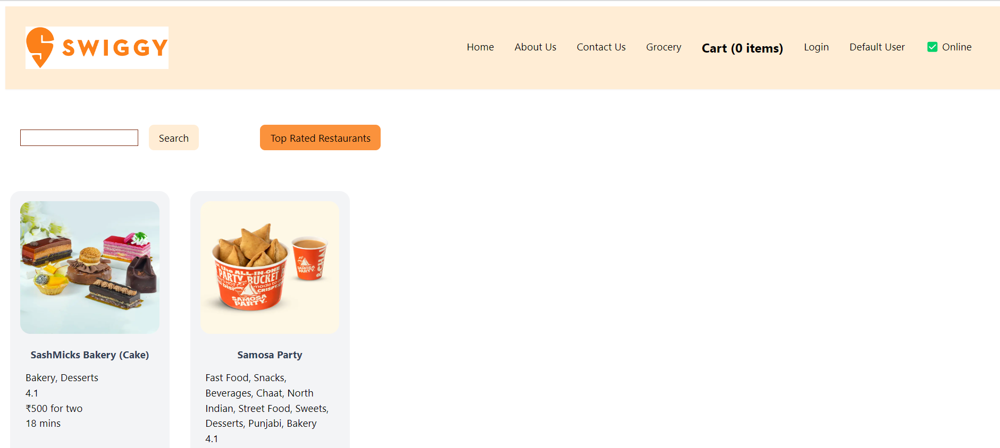
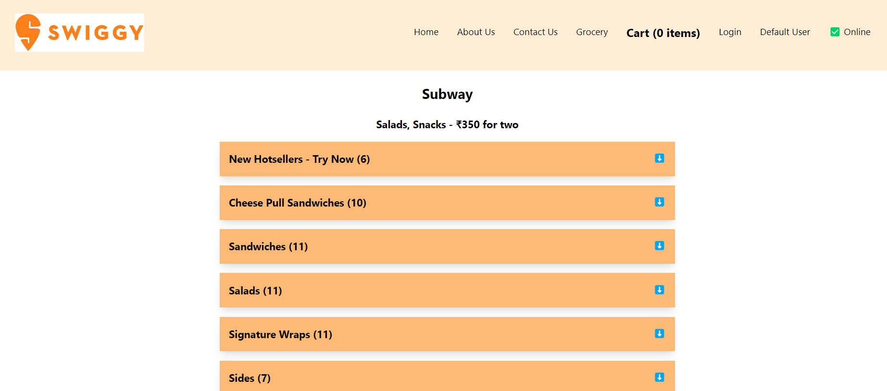

## Food Ordering App

-- App link for learning: https://swiggy-clone-kushal-learning.netlify.app/

## Project Images

# Restaurants List

# Searching Sub for Subways around me

# Top Restaurants

# Restaurants Details

## localhost sample urls

-- http://localhost:1234
-- http://localhost:1234/restaurants/175292

## Configuring Netlify using netlify CLI

-- install netlify globally
(> npm install netlify-cli -g)

-- (not sure if it is mandatory to add this at project level as well)
(> npm install netlify-cli --save-dev)

-- Open cmd with Admin mode and type netlify

-- if it works then navigate to your project, and write > netlify deploy >> It will ask, if you want to use existing, site_Id and produce the draft

-- If draft looks good, then use this command to push to server. > netlify delpoy -- prod
